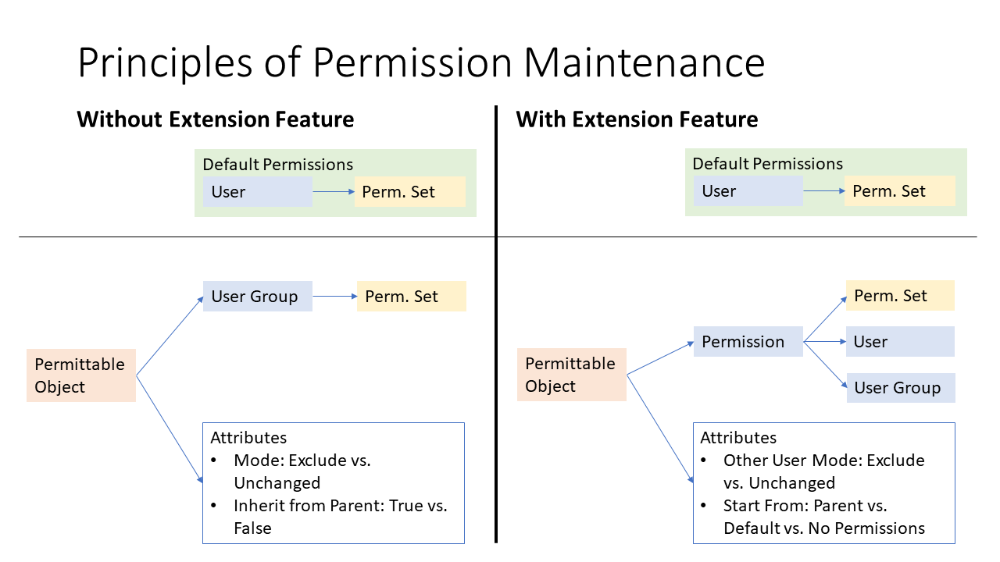
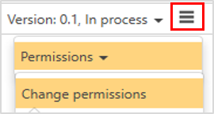
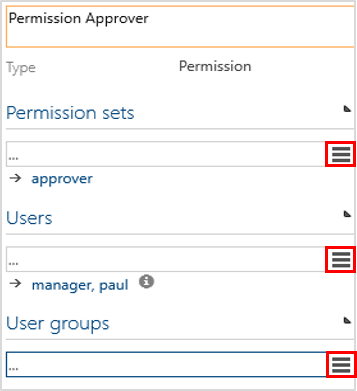

By activating this feature, the permissions assignment is made more flexible and comfortable, as permissions are set directly at the permittable process or object. We point out that this feature __Is one way__. Once it is activated, it cannot be deactivated again.

The following picture illustrates the comparison of the standard permission maintenance with the activated extension feature:

For the general understanding of Symbio Application roles and Permissions sets, please refer to [Permissions - Introduction](https://docs.symbioworld.com/admin/administration/permissions/permissions/).

## Ho to maintain permissions with the extension feature

### 1. Select process or object

Mark process or object for which permissions are to be assigned.  

  

Choose __Change permissions__ in the Toolbar of the Main Content.

### 2. Define inheritance and effect on other users 

There are three options to define on which basis the permissions are set up:

- __Inherit from parent__: Permissions of the selected process or object are automatically adopted from the parent element. Further permissions on this element may be added if required.

    Example: A new created Sub Process should inherit the permissions of the higher-level Main Process. Additionally, the permissions of this Sub Process should be differentiated for a new project team (user group) or team member (user). 

- __Starting from default permissions__: Permissions are set on the basis of existing permission sets assigned to users or user groups before. If no permission sets have been applied, the Symbio standard  application roles (e.g. Author, Architect) are used.

    Example: The existing permissions (permission sets or application roles) are adopted by default for a new created Sub Process. Additionally, the permissions of this Sub Process should be differentiated for a new project team (user group) or team member (user).

- __Starting without any permissions__: Permissions are designed and 
granted from scratch. The Symbio standard application roles will not be considered.

    Example: Any existing permission sets and application roles are not used. The permissions of a new Sub Process are completely redefined; this should be done consistently for all processes and objects.

Regarding the effect on other users, there are two possibilities:

- __Other users have no permissions__: These permissions are exclusively set for a specific user or user group. Other users have no access to the selected process or object.

    Example: A new branch in the process structure should only be available for a newly set up project team (user group). The remaining employees of the company should not have access, not even Viewer rights.

- __Permissions of other users unchanged__: Already granted permissions of other users remain unaffected.

    Example: The permissions of a new branch in the process structure should be differentiated for specific users or user groups. The existing access rights (e.g. Viewer rights) of the remaining employees remain unchanged.

### 3. Create permission types

Click on __New__ to create new permission types, of course only usable for the selected element. It is recommended to create a permission type for each applicable permission set.

In the Detail Content, add corresponding __Permission sets__, __Users__ and __User groups__ to each permission type.

Finally, confirm with OK.

## User scenarios

### Human resources user

This scenario will show how the access rights of a specific business unit of the company can be specified in detail.

Please proceed as follows:

1. Navigate to __User__ tile and create a new HR user, fill in Application role (e.g. Architect); alternatively create a user group for several HR users.

2. Navigate to __Permission sets__ tile and create HR specific permission sets (e.g. "HR Architect", "HR Author" etc.), defining for each set how elements can be edited.

3. Navigate to __Process House__ and set up a new Category or Main Process "HR" (or just select, if existent). 

4. Select __Change permissions__ in the Toolbar; choose "Inherit from parent" and "Other users have no permissions" from dropdown.

5. Create new __Permission types__, e.g. "Author permissions", and go to Detail Content to assign corresponding HR permission set as well as HR user or user group.

6. After click on __OK__ button, changes are applied; as the Admin is still logged in, he does not have any permission to see HR Category or Main Process.

### External user

In this scenario it will be explained how users (or user groups) should have limited access to a specific part of the Process House, e.g. a specific project in which external partners are involved. Permissions of the other users should remain unchanged.

Please proceed as follows:

1. Navigate to __User__ tile and create a new External user, select "Viewer" as Application role; alternatively create an External user group.

2. Navigate to __Permission sets__ tile and create an External user-specific permission set, allowing just to open and to show an element.

3. Navigate to __Process House__ and set up a new Category "Project XY" (or just select, if existent). 

4. Select __Change permissions__ in the Toolbar; choose "Inherit from parent" and "Permissions of other users unchanged" from dropdown.

5. Create new __Permission types__, e.g. "External Viewer permissions", and go to Detail Content to assign corresponding External permission set as well as External user or user group.

6. After click on __OK__ button, changes are applied; and because standard permissions remain unchanged, the Admin has full access to Category "Project XY".

7. Create __Permalink__ of Category "Project XY" and send it to External user or user group, who may now open and see Category "Project XY" by click on this link. 

