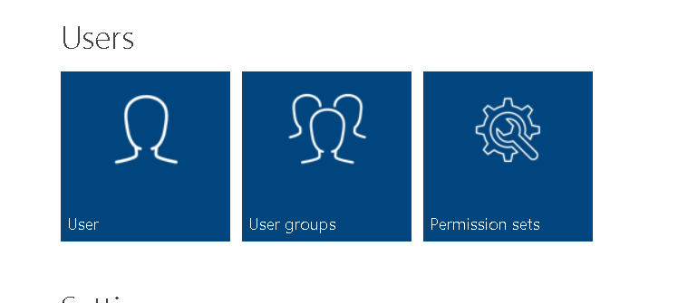
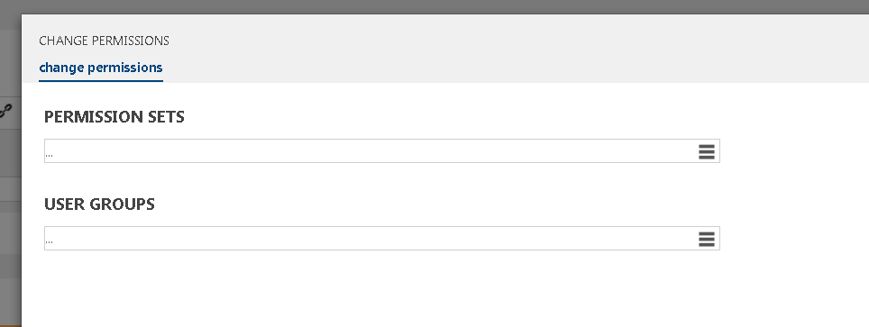
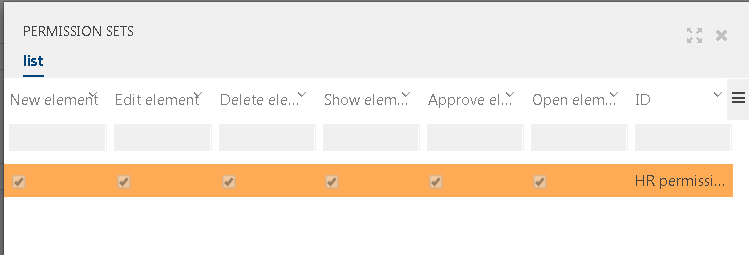
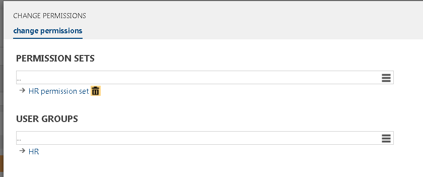
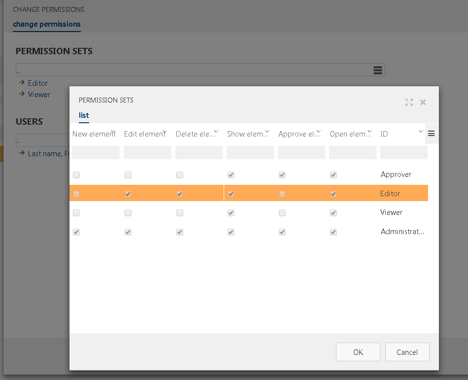
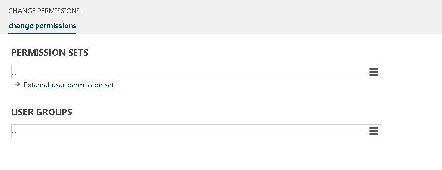
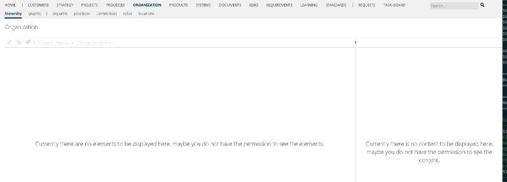

## Permissions

Until Symbio 1807 permissions can be set to Viewer to make the content visible only for a certain group or to author the content for editing.  
If the user group has been defined for the viewer, only the corresponding users are allowed seeing the contents. The following applies to the authors: only registered users of the group are authorized to edit this content and to view.

Since Symbio 1808 the permissions feature has been heavily extended by introducing permission sets. After you have created a Symbio storage collection and Symbio storage, you may want to provide or restrict user access to the storage or its contents. For example, you might want to provide access only to specific members of your team, or you might want to provide access to everyone, but restrict editing for some. The easiest way to work with permissions is to create user groups and permission sets, which will help you create fine-grained permissions that suit your specific needs. Permissions in Symbio are in tight relation to application roles that distinct between different user roles in the system. This document will in detail explain how, both application roles and permissions work together and how permissions cascade through Symbio object hierarchies.

The following chapter describes Symbio 1808 permission sets feature.

### Application roles

When creating users in Symbio it is important that you define application roles for each user. Symbio supports following application roles:

- Viewer
- Author
- Approver
- Architect
- Administrator

Each application role has rights that are specific for that role and must be considered when working with permissions.

Viewer:
- Has right to navigate process landscape in process portal
- Has right to navigate repository
- Has right to search for content
- Has right to create manual or guide for the organization
- Has right to create link to processes

Author:
- Has right to model sub processes (create sub processes)
- Has right to make sub processes and repositories available for release
- Can modify only processes that he created or processes where he is defined as additional author. Processes which don't have author defined can also be edited
- Has right to create their own repository objects
- Has right to connect existing repository objects to process

Approver:
- Has right to delegate decision about releasing or rejecting process or object to another person
- Has right to reject the release
- Has right to accept process or repository object to release it

Architect:
- Has right to create processes with Categories and Main Processes
- Has right to create repository objects 
- Has right to setup process house
- Has right to modify and create objects with a hierarchical structure (organization, it, guidelines), repository objects with tabular structure (roles, input/output) and global tasks

Administrator:
- Has right to change every process and object in Symbio
- Has right to administer users, user groups and permission sets
- Has right to administer every aspect of Symbio configuration

For details about each of these roles please refer to Symbio Manual. 

Application roles work together with permissions which will be in detailed explained in this document.

### Permission sets

Permission sets allow you to quickly and easily provide common levels of permissions for one user or group of users. Permission sets define permissions that apply to processes and other elements that use permissions in Symbio. Available permissions are: New element. Edit element, Show element, Delete element, Open element, Approve element.

Symbio provides several default permissions sets that can be used for most scenarios. Default permission sets with its permissions are shown in table below:

Some permissions are part of Symbio application roles functionalities. These special permissions always force their rules as they are defined in application roles. There are two type of rules.

1. Rules that define what is forbidden in Symbio application – these restrictions cannot be later altered with permissions sets. 
2. Rules that define what user can do – this can be additionally altered with permissions sets.

Examples:
1. Application role Author has defined rule that Author role cannot create Categories or Main Processes. This cannot be modified with New Element permissions defined in permission set for user. Application role Author has also rule, that sub process can be created, but this rule can be altered with permissions, if we remove New Element from permission set then, user won't be able to create Sub process as well.

2. Application role Author has defined rule that he cannot edit processes that other authors created. Adding permission that has Editing permission to the user won't change this rule that was defined by application role Author.

#### Overview permissions and inheritance

When working in Symbio you deal with lot of different types of objects: Processes (main processes, sub processes, categories), Risks, Organizations, Products, Systems, Documents, Customers, Projects etc. Some of these objects are organized into hierarchies and on top of every hierarchy lays top-level object. These top-level elements are called root objects. For example, top level object of processes hierarchy is Process house. Permissions can be applied to any element in object hierarchy except the root element that should be accessible to all users.

#### Inheritance

An important concept to understand is permissions inheritance. By design, all object that exist in process hierarchies inherit the permissions settings of the parent element in hierarchy. When you assign unique permissions to objects that are lower in hierarchy those objects no longer inherit permissions from their parent object. Instead of that they have their own permissions and inheritance can be applied for their children, too.

#### Permission sets administration

Administration of Permission sets is in Admin area of Symbio storage. 

Please navigate to Admin panel in right upper corner. 

After opening admin panel, you can see all groups that you can administrate. In this case you need Users group. Administration of permissions is done through tree menu items: 

1.	User, 
2.	Users group and 
3.	Permission sets. 

Administration of users provide options for creating new or modifying existing Symbio users. All information for users is entered here: personal data, password, application roles etc.

Administration of user groups provide options for creating new and modifying existing user groups. User groups are used to group users with same permissions to groups, to make administration of permissions easier. User groups are connected to permission sets as well as users, making the connection between them.

Administration of permission sets provide options for creating new and modifying existing permission sets. Selected permissions can be grouped together into permission sets to make administration of permissions easier. After you define permission sets they can be added to users or to user groups.

#### Administration of users

Administration of users can be found in administration area of Symbio storage. If user is logged in as Administrator, and connected to Editor mode, he can access Admin panel in right upper corner.

After opening admin panel, all items for administration are shown. In this case you need to choose Users menu. By choosing Users, administration of Users will be open. All users that are already created are shown in the grid. When User is selected, on the right side, in Detail content, all options that can be changed for that user will be shown.

Very important option for permissions, that can be set for users, is Application roles option. Please refer to user manual for description of other options that are available for users.

To modify User groups and Permission sets of the User, you need to select User in grid and after that you need to click on Change permission button (Change permission button is located in the toolbar), and it will open dialog box for editing permission sets of the user. 

In this dialog box permissions sets and user groups are assigned to the selected user. One or more Permission sets can be added to the User, as well as one or more user groups, but User can have no Permission sets, and/or no User groups, as well. One user can be added in more than one user group. Dialog box for administrating User has two options that can be added or changed. Permission Sets and User groups. To add new permission sets, you need to click on permission sets hamburger icon, and new dialog for selecting permission sets will be open. 

If permission set assigned to user needs to be removed, user needs to hover over permission until trash can is shown. Clicking on it, system will ask to approve that user want to remove that permission set from user group. After approval, permission set will be removed from the list. 

When we add permission sets to a user we define default permission sets for that user. These permission sets are applied on all elements in Symbio, where no specific rights are applied to elements. It is necessary to have in mind that rights that are assigned by default permissions, additionally can be altered by application roles that are assigned to the user. Permission sets can only limit rights that are assigned by application roles and in no case cannot extend them. One user can have more than one Permission sets. In that case, union of all permissions contained in those permission sets, will be applied to that user. In other words, user will have permissions from all Permissions sets assigned to him.

User can be added to the User group, which will be explained below in Administrating User Group chapter, and User group can be assigned to the User. That can be done using dialog box Change permissions. 
After clicking on User groups, new dialog box will be opened, and new user group can be assigned to the User, that user will be in that User group. User groups can be removed from the list the same as it is explained for removing permission sets above. 

More than one User group can be assigned to the User. That means that one User can be assigned to more different User groups that have different Permission sets. Each User group will give User some specific permissions in the system, and they can, but don’t have to, exclude themselves  . In other chapters it will be seen how users can have different permissions depending on membership in User groups.

#### Administration of User groups

To edit user group and add or edit Permission sets of the user group, you need to select desired row and clicks on Change permission button. Change permission button is located in the toolbar, and it opens dialog box for editing permission sets of user group. 

Dialog box for administrating User group, is similar to dialog box for editing Permission sets with similar options. There are two options that can be added or changed. Permission Sets and Users. To add new permission sets, you need to click on hamburger on the right side of permission sets part, and new dialog for selecting permission sets will be open. 

It is possible to navigate to Permission sets list directly from this dialog box, by clicking on the linked name of that Permission set. After clicking on the link, system will open the list of all Permission sets and selected Permission set marked with orange colour. From there you can further administrate Permission sets.

One or more users can be added by selecting hamburger on the right side of Users lookup field. New dialog will be open, and user can be added to current user group. 

User groups are used to set special permissions to the object, and that will be explained below in chapter “Permissions on objects”.

#### Administration of permission sets

Permission sets can be created, edited or deleted. All permission sets are showed in list when user is logged in as Administrator.

After selecting permission set in list, details of that permission set will be displayed in Detail content on the right side, showing what permission sets are selected. To edit permission set, user needs to select desired permission set, and click on Change permission button, that is in the toolbar, when the new dialog, for editing permission set, will be open. 

Here user can select or deselect permission set options. 

__New element__ – the user will have permission to see, open, create new and edit the element, New element option cannot be selected separately, all Edit element, Show element and Open element will be automatically selected

__Edit element__ – the user will have permission to see, open and edit the element. Edit element option can be selected without New Element option, but not without Show and Open element, those selection are done automatically. 

__Delete element__ – the user will have permission to see, open and delete the element. After selecting Delete element option, Show element and Open element will be automatically selected, and it is not possible to unselect them without unselecting Delete element option as well. 

__Show element__ – the user will have permission only to see elements, without any details about selected element. If there is no option to see only name of the elements, without showing some details, user will not be able to see anything. This option is always selected when some other option is selected. And it is only option that can be selected by itself.

__Approve element__ – the user will have permission to see, open and approve the element. After selecting Approve element option, Show element and Open element will be automatically selected, and it is not possible to unselect them without unselecting Approve element option as well.

__Open element__ - the user will have permission to see and open the element. After selecting Open element option, Show element will be automatically selected, and it is not possible to unselect it without unselecting Open element option as well. Open element option is usually used for users that should only see all elements and their details.

After selecting desired option clicking on OK button will save the changes and Cancel button will discard them.
For creating new permission set, you enter the name of Permission set and click on button New. New row in grid below will be shown, but without any permission set chosen yet. In the right part, in Detail panel, message is shown that says “Please use the corresponding menu entry in the toolbar to change permissions.” 

Procedure for adding new permission sets is the same as editing permission sets, that is explained above.
It is also possible to leave Permission set without selecting any options - user can create empty permission set. 

Permissions on objects

Permission sets can be assigned to object in every element, as for example category, process, sub process etc.. on all types of object in Symbio.
Selecting desired element for what Permissions should be changed, in toolbar button Change permissions will be shown. After clicking on it, new dialog box will be open, and it will be possible to changes permissions for that selected element.

There are three options that can be set in Change permission of an element. 

__Permitted groups__ - Here User groups, with specific Permission sets and Users,can be assigned. It can be added more User groups. Users in those groups will have Permissions from that User group, on that selected object. 

__Inherit permission from parent__ - This option can be selected or deselected. By selecting this option, the inheritance of the current object from its parent is controlled.  If a user group is set and this option is set, all users in the user group get the permissions of the user group plus the permissions that would inherit from the parent, i.e. the permissions they would have without any permission setting at the current object. 
If the option is not set, the users of the user group get *only* the permissions from the permission set of the user group, i.e. the permissions from the parent object have not influence on the current object for the users in the current user group.

__Permission mode__ – For this option, one of two options can be chosen. Default option, that is selected when dialog box is opened first time is Exclude users from other user groups. That means that only users from chosen User groups will be able to see selected object. Other option is Standard permissions for other users. If this option is selected, all users (if their rights allow them) will see that object, but only users, from chosen user groups for that object, will have permissions from that are assigned to chosen User group.

#### User scenarios

__1. Human resources user__

  In this scenario it will be explained how user groups and permission sets can be used, and how can user groups and permission sets help to hide or show only specific part of the system from specific user or user group. This will be shown on example of Human resources, and how only HR group can see some categories.

Steps:

  a. Administrator creates Permission sets “HR permission set”, which has all permission selected. This Permission set will later be added to users and user groups. 

  b. Administrator create user ‘HR assistant’. User role is Architect. All other attributes that are needed are filled in. 

  c. Administrator changes permissions on user that he has created. For permission sets he selects Permission set that he created in step one “HR permission set”, and user group will be added after he creates new User group.

  d. Administrator creates new User group “HR” from Admin panel. In Change permission dialog box, he chooses for Permission sets permission set that he created in step a. “HR permission set”, and in User part he adds new user “HR assistant” that he created in step b.

  e. After he created all necessary steps for using permission sets correctly on object Administrator navigates to Processes and select Category “HR Processes”, where are all processes that are involved with HR team. In toolbar Administrator goes on Changes Permission button. 

  f. On Change Permission dialog box he chooses User group “HR” for permitted groups, select option for Inheritance and select option “Exclude users from other user groups”. 

  g. After click on ok button, changes are applied and because Admin user is still logged in, he does not have permission to see HR Processes Category, Category in graphic view is disabled, and all processes inside it are not visible. In Tree view nothing is visible.

  h. Next step is to log out as Administrator and log in as new HR user and go in Editor mode. Navigate to processes as HR user. Category for HR Processes is visible and usable. User can see, open, add new and edit all elements, which Admin user couldn’t do after settings permission to HR Category. 

Using this example Administrator could create any User group with necessary Permission sets, assign to the group specific Users. Different kinds of group, with different Permission sets could provide to specific users to only they can see and/or modify some parts of system.

__2. External user__

  In this scenario it will be explained how user groups and permission sets of the user will provide possibility for some user to just see some specific part of the system. This will be shown on example of External user and how External user can see only specific part of the system.

Steps:

a. Administrator creates Permission sets “External user permission set”, which has none permission selected. This Permission set will later be added to External Users. Administrator then creates new Permission set "Viewer user permissions" which has Open and Show element permission selected. This Permission set will later be added to External User group.

b. Administrator create user ‘External user’. User role is Viewer. All other attributes that are needed are filled in.

c. Administrator changes permissions on user that he has created by selecting on Change permissions button. In dialog box for permission sets he selects Permission set that he created in step one “External user permission set”, and user group will be added after he creates new User group. After this step, if user would logged in, nothing will be shown to the user, only navigation bar. 
Administrator creates new User group “External” from Admin panel. In Change permission dialog box, he chooses for Permission sets permission set that he created in step a. “Viewer user permissions”, and in User part he adds new user “External user” that he created in step b. 

d. After he created all necessary steps for using permission sets correctly on object Administrator navigates to Processes and select Category “External Processes”, where are all processes that External user should have permissions to see and open. In toolbar Administrator goes on Changes Permission button 

e. On Change Permission dialog box, he chooses User group “External” for permitted groups, select option for Inheritance and select option “Standard user permissions”.

f. After click on ok button, changes are applied and because Admin user is still logged in, he has permission to see External Processes Category, because Standard user permission has been chosen.

g. After Setting permission to the External processes, Administrator must get Permalink of that category, so he would send direct link to the External user. Permalink icon is located in toolbar of category, or any process. Dialog box for Link creation is opened, and there is a button create link, on what Administrator clicks on, and below new link is created. Next to the link, after Administrator hover on the link, Copy icon is shown. 
After clicking on the icon, user gets the message that Link is copied to the clip board. Administrator can paste that link directly to the External user or save it in some document.

h. Administrator pasted link to the External user and next step is to log out as Administrator and log in as new External user. External user paste link that he got, from Administrator, in to the browser. After he presses enter button, process category that he is allowed to see and open are loaded. User can see and open, but this user cannot see any other part of the system. 
Using this example Administrator could create any User group with necessary Permission sets, assign to the group specific Users. Different kinds of group, with different Permission sets could provide to specific users to only they can see and/or modify some parts of system.

